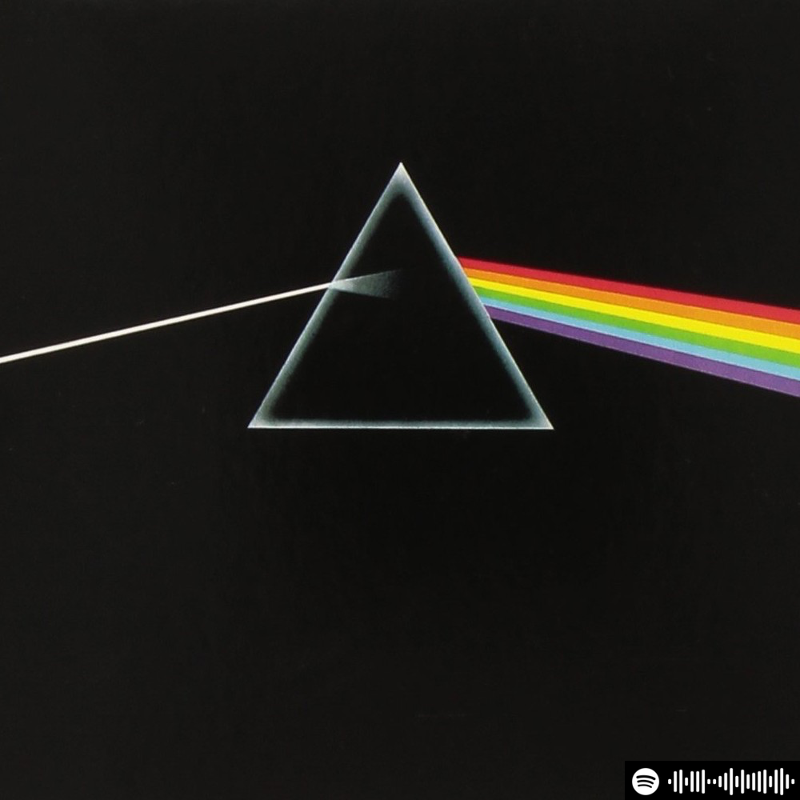
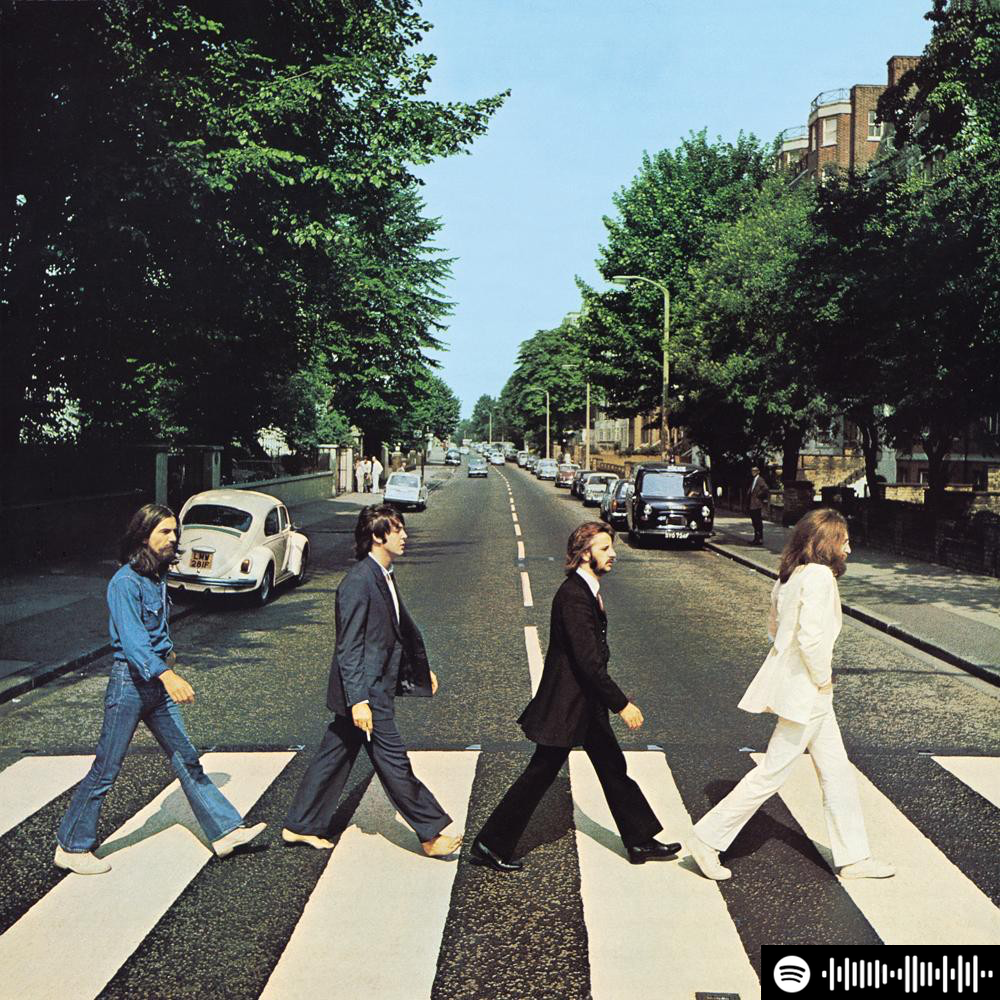

Here is info on how you can make beautiful album covers to print on
your wall, along with an embedded Spotify code, so that visitors to
your home can simply open Spotify, aim at the Spotify code, and
start playing that album. If you have a bluetooth receiver or Sonos
home setup, you could setup your guests to play directly to your
speakers.

<ol>
<li>Download <a target="_blank" href="http://www.spotify.com">Spotify</a> on your computer.  
</li><li>Use <a target="_blank" href="https://www.spotifycodes.com/">Spotify Codes</a>
to generate codes if you paste in the Spotify URI which you can get from
the Share menu in the Spotify app.
</li><li>Find album art such as
<a target="_blank" href="https://www.billboard.com/photos/6715351/best-album-covers-of-all-time">here</a>.
</li><li>Use an image editor to embed the spotify code into the bottom
right of your album art, print, hang on wall.
</li><li>Open Spotify search on your phone, click on the camera icon, point
it at the desired album cover. Voila!  
</li></ol>

Here are a couple album covers that I did. You can try these by
opening Spotify on your phone, clicking Search, then camera icon,
then aim at one of these Spotify codes in the bottom right of one of
these album covers.

  

